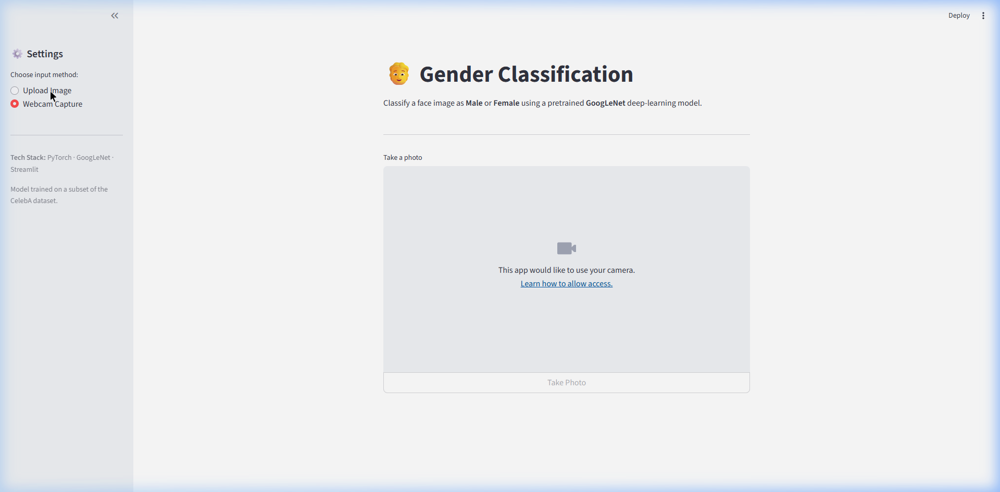
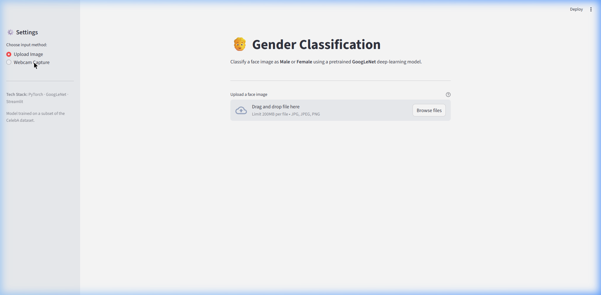
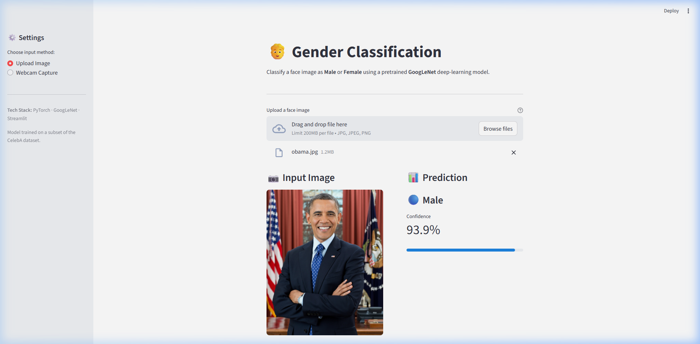

# Face Recognition & Gender Classification

This project is a Computer Vision system focused on Face Recognition and Gender Classification. It utilizes the **CelebA (CelebFaces Attributes Dataset)** as the underlying dataset for facial profile analysis. 

The primary model architecture used for training is **GoogLeNet**, implemented in PyTorch, to analyze and classify features from images based on mapping from a text attributes file.

## 🚀 Key Features
- **Exploratory Data Analysis (EDA):** Visualizing distributions of various facial attributes (e.g., Male, Smiling, Bangs).
- **Data Pipeline:** Custom PyTorch `DataLoader` to map images to their respective attributes from `list_attribute.txt`.
- **Deep Learning Model:** Training a Convolutional Neural Network (CNN) using GoogLeNet to classify gender.
- **Evaluation:** Generating classification reports and confusion matrices to evaluate model performance.
- **Interactive UI:** Streamlit frontend application (`app.py`) allowing users to classify gender from uploaded images or live webcam captures.

## 🛠️ Technologies Used
- **Language:** Python
- **Deep Learning Framework:** PyTorch (`torch`, `torchvision`)
- **Data Manipulation:** Pandas, NumPy
- **Image Processing:** Pillow (PIL)
- **Machine Learning Utilities:** Scikit-learn
- **Visualization:** Matplotlib, Seaborn
- **Environment:** Jupyter Notebook

## 🗂️ File Structure
- **`googlenet-gender-classification.ipynb`**: The main notebook containing the full pipeline from EDA, DataLoader creation, model training, and evaluation.
- **`app.py`**: The Streamlit frontend application for interactive gender classification using the trained GoogLeNet model.
- **`requirements.txt`**: List of dependencies required to run the Streamlit application.
- **`best_model.pth`**: The saved state dictionary of the best performing model.
- **`list_attribute.txt`**: The ground truth labels (40 attributes) for all images in the dataset.
- **`Images/`**: Directory containing the sample `.jpg` faces used for training and validation.
- **`template/VGG_GoogleNet_ResNet_(Template).ipynb`**: A reference notebook template containing boilerplate code for other model architectures (VGG, ResNet).

## ⚙️ How It Works (Pipeline)

1. **Data Preparation & EDA:** The project begins by reading the `list_attribute.txt` to gather image labels, specifically focusing on the `Male` attribute for gender classification. It filters valid images that exist in the `Images/` directory and visualizes their distribution.
2. **PyTorch DataLoader Pipeline:** Images are processed using `torchvision.transforms` (resize to 224x224, center crop, normalization) and fed into a PyTorch `DataLoader` after splitting into training and testing sets using Scikit-Learn.
3. **Deep Learning Training:** The GoogLeNet model (or alternative ResNet/VGG templates) is initialized and trained using an optimizer and loss function (e.g., CrossEntropyLoss). The model with the best validation accuracy is saved as `best_model.pth`.
4. **Inference & Evaluation:** The trained model is evaluated on the test set, generating metrics like precision, recall, f1-score, and a confusion matrix.

## 🚀 Getting Started
### Running the Streamlit App
To run the interactive web application:
1. Ensure your dependencies are installed: `pip install -r requirements.txt`
2. Run the application: `streamlit run app.py`
3. Access the UI via your web browser to upload images or use your webcam.

### App Screenshots

**Upload Image Mode**:

**Webcam Capture Mode**:

**Prediction Result Example** (Male with 93.9% confidence):

### Training the Model
1. Ensure you have the required dependencies installed (PyTorch, Pandas, Scikit-learn, Matplotlib, Seaborn).
2. Ensure the `Images/` dataset directory is populated with CelebA `.jpg` images.
3. Run the `googlenet-gender-classification.ipynb` notebook step-by-step.